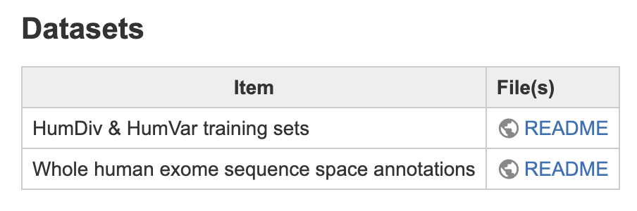
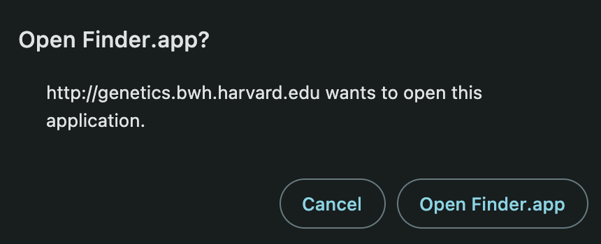
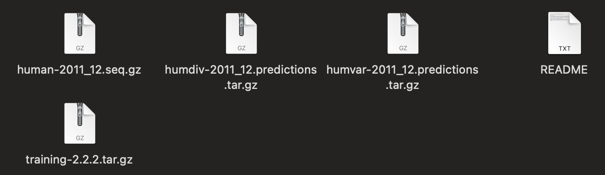
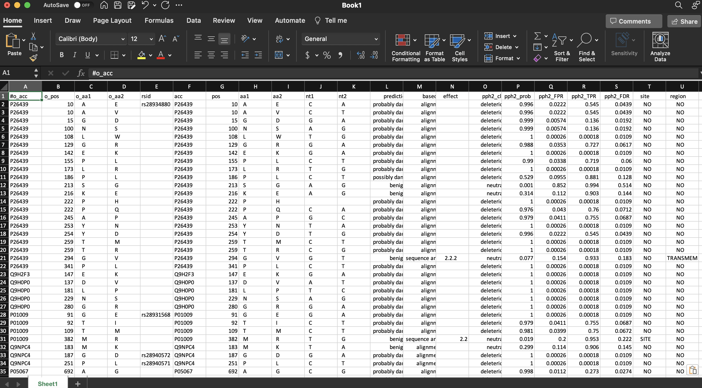
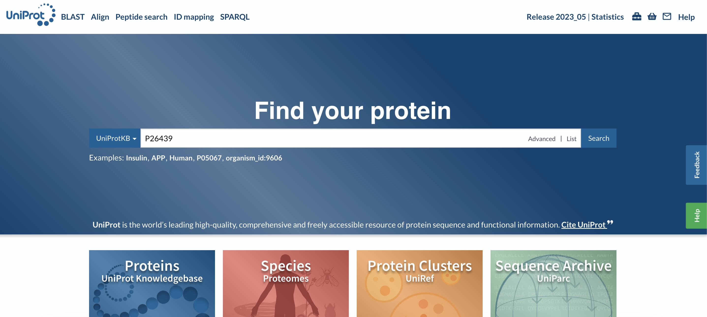
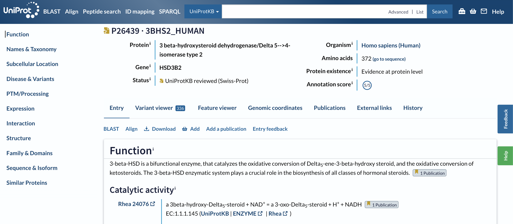
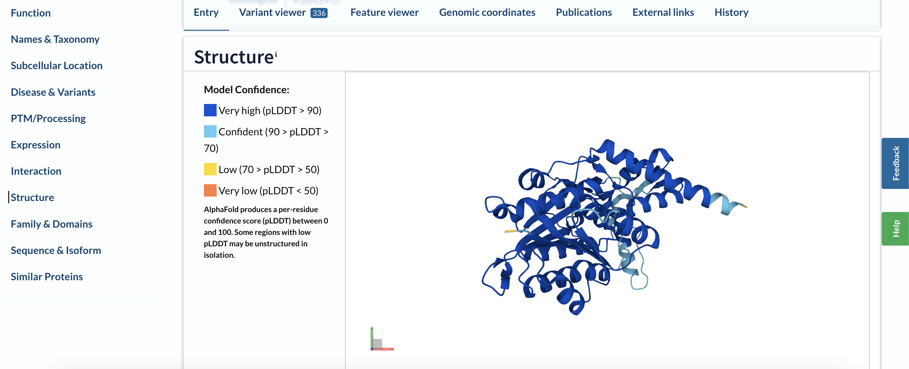
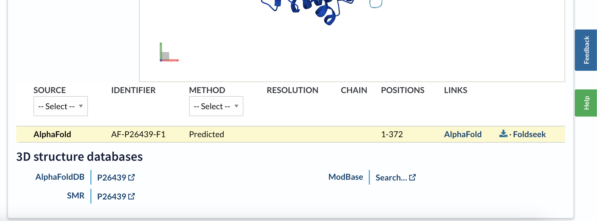

# Guide for gathering HumDiv & HumVar datasets and matching AlphaFold structures

## 1) Download data from PolyPhen-2 website or 2) use the data from provided HumDiv_HumVar_sets directory

### 1) Download data from PolyPhen-2
go to `PolyPhen-2` website to gather the datasets:

```
http://genetics.bwh.harvard.edu/pph2/dokuwiki/downloads#datasets
```

scroll down to `Datasets`



click `README` under the `File(s)` column for the first row



Click `Open Finder.app` on Mac or `File Explorer` on Windows computer



download and extract the files

### 2) Use data in HumDiv_HumVar_sets directory

open `humdiv-2011_12.deleterious.humdiv.output` file with `Microsoft Excel`



Column `F` (acc) contains the `UniProt` ids

#### Example

Selected `UniProt` id is `P26439`

Go to `https://www.uniprot.org/`

and search for the id



When you click enter it will go to the following page:



Scroll all the way down to `Structure` heading





Select the `AlphaFold` structure from the `Yellow` highlighted panel and click the `Download` button on the right side between `AlphaFold <> Foldseek`
